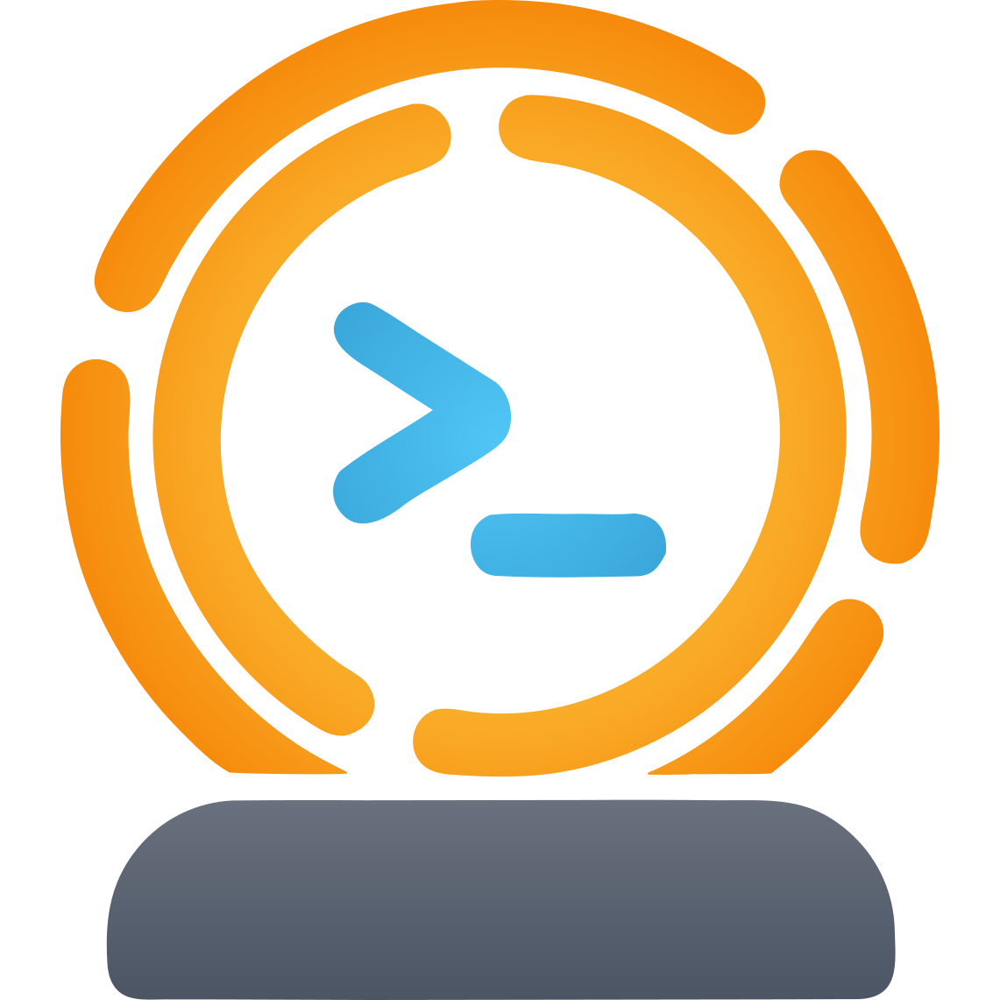

# Séance-fork

<p align="center">
  
</p>

<p align="center">
  A scrolling terminal multiplexer that tracks your AI coding agents.
</p>

**Séance-fork** is an experimental fork of the [Séance](https://github.com/no1msd/seance) scrolling terminal multiplexer that tracks your AI coding agents, with additional features and enhancements:

- 🤖 [OpenCode](https://opencode.ai/) coding agent support
- 🤖 [Kilo CLI](https://kilo.ai/cli) coding agent support
- 🤖 Xioami [MiMo Code](https://mimo.xiaomi.com/mimocode) coding agent support
- 🤖 Mistral [Vibe](https://github.com/mistralai/mistral-vibe) coding agent support


<br/>

<p align="center">
  
</p>

## Why Séance?

Séance is a GTK4 terminal multiplexer for Linux. It auto-detects [Claude Code](https://docs.anthropic.com/en/docs/claude-code), [Codex](https://github.com/openai/codex), [Pi](https://github.com/badlogic/pi-mono), [OpenCode](https://opencode.ai), [Kilo Code](https://kilo.ai), [MiMo Code](https://mimo.xiaomi.com/mimocode) and [Vibe](https://github.com/mistralai/mistral-vibe) sessions running inside it and tracks their status (working, waiting for permission, idle) live in the sidebar. Permission requests and task completions are surfaced as desktop notifications with unread tracking. Zero configuration, no dotfile edits: open an agent in a pane and it is tracked.

### Linux-native, not Electron

GTK4 and libadwaita, so it integrates with the rest of GNOME and with tiling WM setups. X11 and Wayland. Blur and transparency on both. GPU-accelerated terminal rendering via [libghostty](https://ghostty.org) (Ghostty used as a library).

### Scrolling layout

Panes are arranged in a horizontal strip that you scroll through, borrowing the layout model from [niri](https://github.com/YaLTeR/niri). Fits long, linear agent sessions better than a tiling grid, and lines up naturally with scrolling tiling WMs.

### Agent-agnostic

Claude Code, Codex, Pi, OpenCode, Kilo CLI, MiMo Code, and Vibe  are auto-tracked out of the box. Adding support for another agent is a hook config PR rather than a rewrite. Agents that do not speak hooks still get all the plain multiplexer features.

### Scriptable

Every action is available through `seance ctl`, which talks to the running instance over a Unix domain socket. Scripts and AI agents can create workspaces, open panes, send input, read terminal output, and query the full session hierarchy. All commands support JSON output.

A bundled [skill file](skills/seance-skill.md) provides AI agents with a complete reference for the `seance ctl` API, so they can use the multiplexer on their own.

### And also

Workspaces, session persistence across restarts, tabs within columns, a command palette, focus-follows-mouse, and no telemetry.

## Installation

### AppImage

Download the latest `seance-*-x86_64.AppImage` from [GitHub Releases](https://github.com/scross01/seance-fork/releases), make it executable, and run it:

```bash
chmod +x seance-*-x86_64.AppImage
./seance-*-x86_64.AppImage
```

Requires `libfuse2` on the host. Uses the host's `libGL`/`libEGL`, so Mesa or proprietary GPU drivers must be installed.

To use `seance ctl` from your shell, move the AppImage onto your `PATH`:

```bash
mv seance-*-x86_64.AppImage ~/.local/bin/seance
```

### Building from source

Requires Zig **0.15.2+**, GTK4, libadwaita, OpenGL 4.3+, and Linux (X11 or Wayland).

**Install build dependencies (Ubuntu/Debian):**

```bash
sudo apt install pkg-config libgtk-4-dev libadwaita-1-dev libnotify-dev libcanberra-dev
```

**Build:**

```bash
git clone --recursive https://github.com/scross01/seance-fork.git
cd seance
zig build
```

The binary is at `zig-out/bin/seance`.

If the ghostty dependency is missing:

```bash
git submodule update --init --recursive
```

## Agent Integrations

Claude Code, Codex, Pi, OpenCode, and Kilo Code are all tracked automatically — no setup required.

- **Claude Code, Codex, Pi**: Séance installs wrapper scripts that intercept calls to these agents and inject lifecycle hooks transparently.
- **OpenCode**: On first launch, Séance auto-installs a plugin to `~/.config/opencode/plugins/` if the OpenCode config directory exists.
- **Kilo Code**: On first launch, Séance auto-installs a plugin to `~/.config/kilo/plugins/` if the Kilo config directory exists.

To disable OpenCode integration: **Settings → Terminal → OpenCode Integration**, or set `opencode-hooks = false` in `~/.config/seance/config.toml`.

To disable Kilo Code integration: **Settings → Terminal → Kilo Code Integration**, or set `kilo-hooks = false` in `~/.config/seance/config.toml`.

## Contributing

Bug reports, feature requests, and pull requests are welcome. See [CONTRIBUTING.md](CONTRIBUTING.md) for how to file issues, build locally, and add support for new agents. Questions and show-and-tell go in [Discussions](https://github.com/no1msd/seance/discussions). Security issues should be reported privately, see [SECURITY.md](SECURITY.md).

## License

[MIT](LICENSE)

## Acknowledgements

- [Séance](https://github.com/no1msd/seance) original terminal multiplexer for AI agents.
- [Ghostty](https://ghostty.org) for terminal emulation
- [cmux](https://github.com/manaflow-ai/cmux) and [niri](https://github.com/YaLTeR/niri) as key inspirations for layout and interaction model
- Built with [Zig](https://ziglang.org), [GTK4](https://gtk.org), and [libadwaita](https://gnome.pages.gitlab.gnome.org/libadwaita/)
